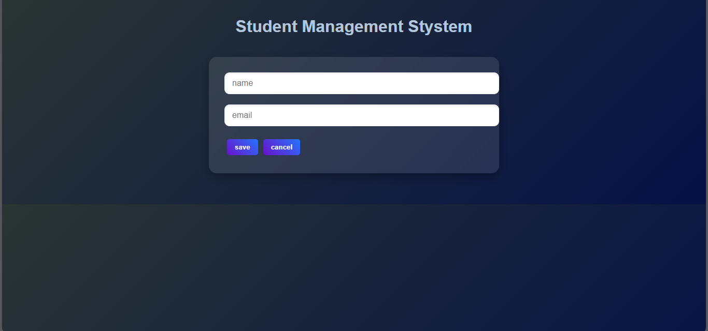

# Student Management System 🎓

A simple **Student Management System** built with **Spring Boot (MVC)** for the backend, **React.js** for the frontend, and **MySQL** for the database.  
You can view, edit, update, and delete student records easily with a stylish UI.

---

## ✨ Features
- View all students
- Edit student details
- Delete a student
- Cancel and return to the main page
- Responsive and modern UI
- API communication between backend and frontend

---

## 🛠️ Tech Stack
- **Backend**: Spring Boot 3.4.5, Spring Data JPA
- **Frontend**: React.js (Vite)
- **Database**: MySQL
- **Other Tools**: Maven, Axios, Java 17

---

## 🖼️ Interface Screenshot

